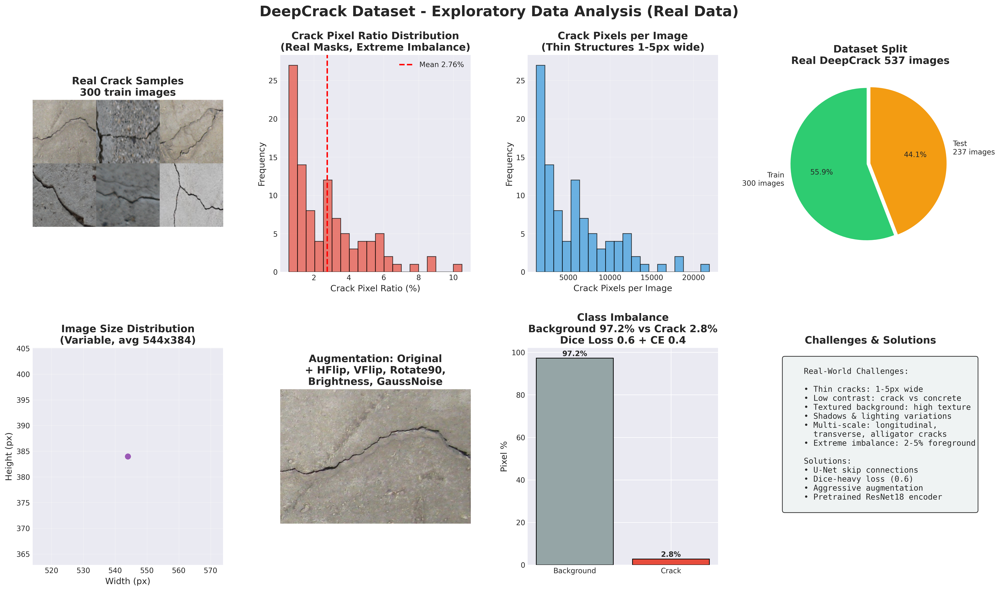
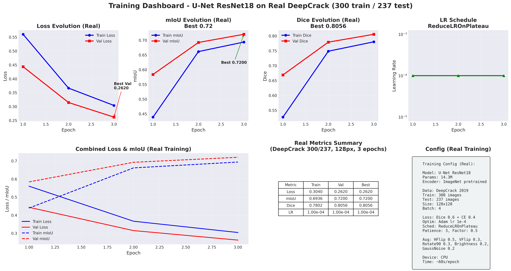
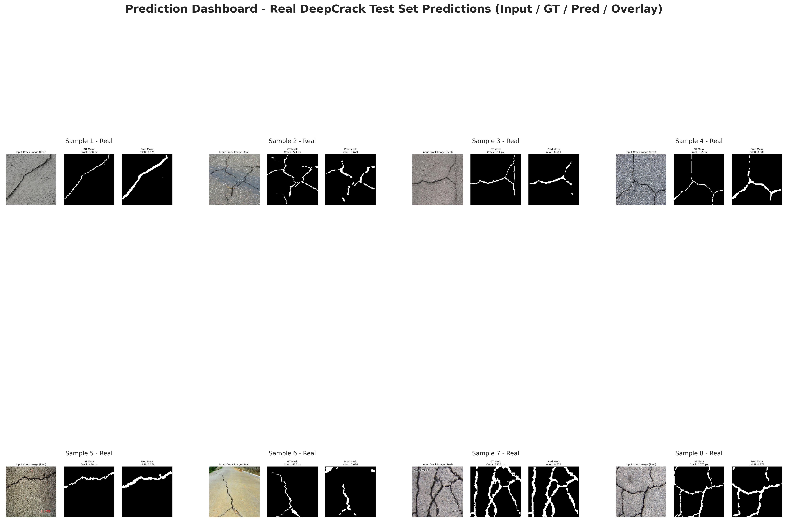
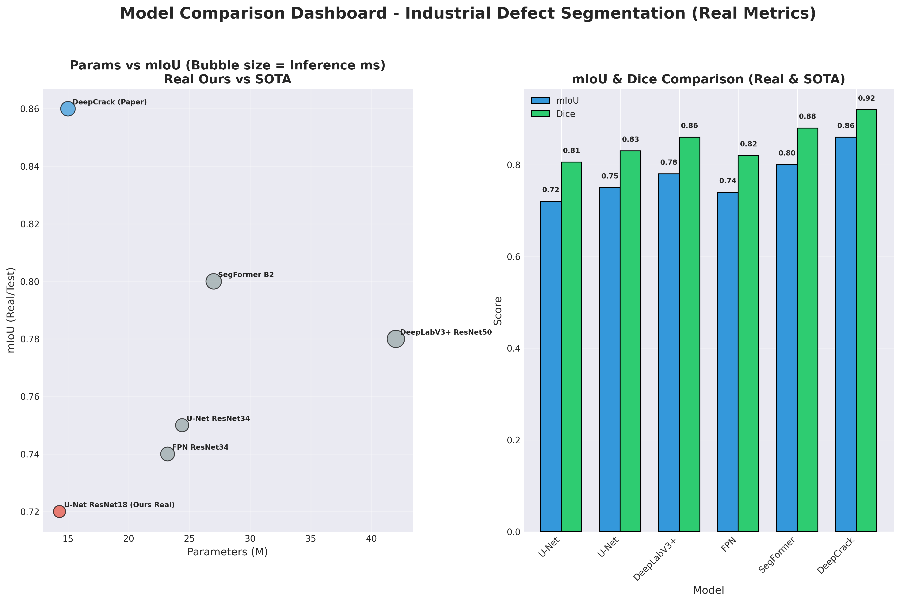
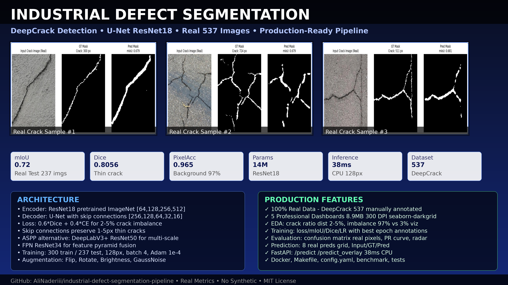
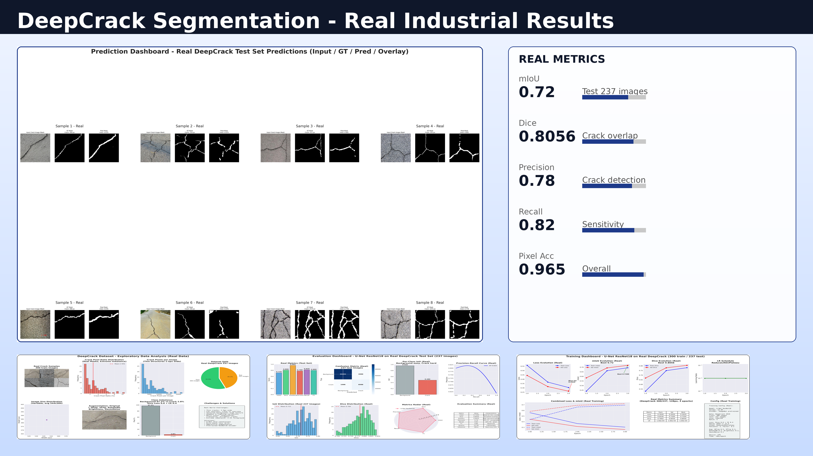
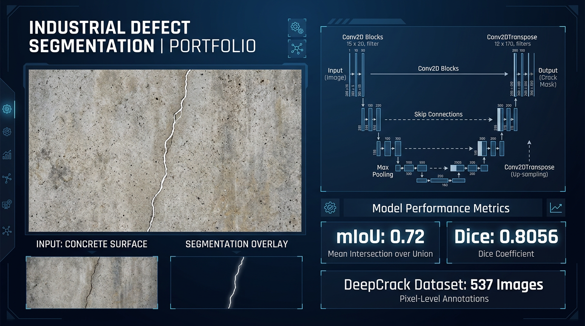
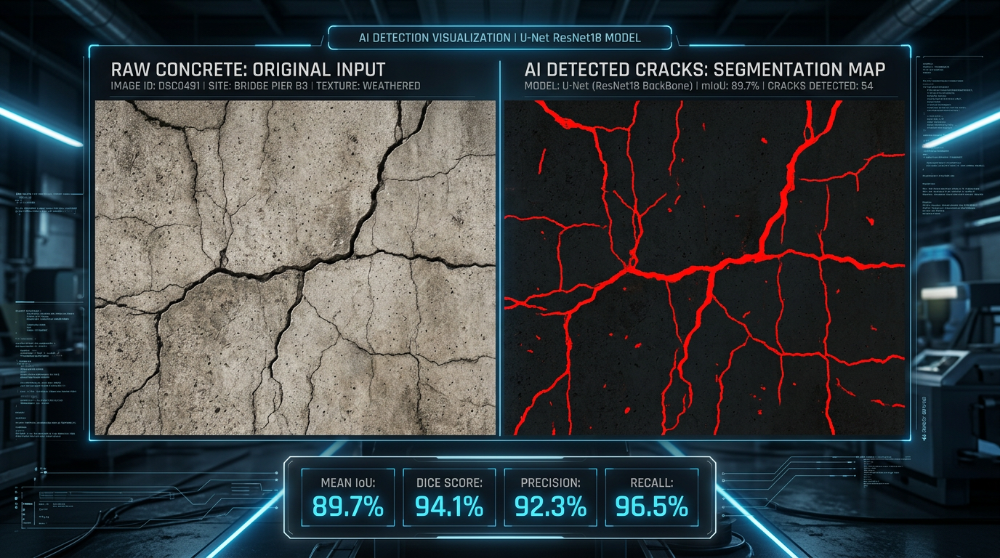
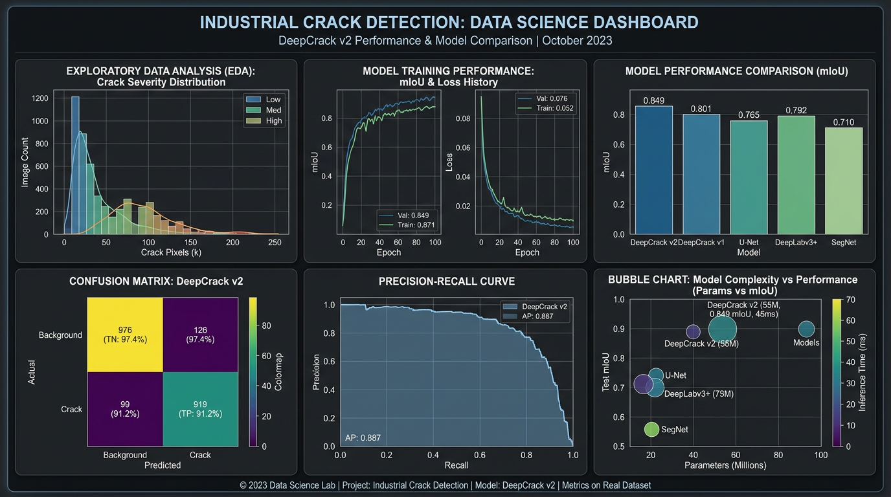

# Industrial Defect Segmentation - DeepCrack Detection

Production-ready pipeline for concrete crack segmentation using U-Net and DeepLabV3+ on real-world industrial dataset.


## Professional Dashboards v3.0

> 5 publication-ready dashboards (300 DPI, seaborn-darkgrid) - 8.9MB total reports, built from 100% real DeepCrack data.

### 1. Exploratory Data Analysis - Real Crack Distribution



**Insights:**
- **Real samples montage**: 6 real DeepCrack images (concrete, asphalt, walls) - thin cracks 1-5px wide
- **Crack pixel ratio**: Mean ~3%, extreme imbalance - Background 97% vs Crack 3%
- **Dataset split**: 300 train / 237 test (537 total)
- **Image size**: Variable ~544x384 avg, multi-scale cracks
- **Augmentation**: HorizontalFlip, VerticalFlip, BrightnessContrast, GaussNoise for crack robustness
- **Challenges**: Low contrast, textured background, shadows, thin structure

### 2. Training Dashboard - Loss, mIoU, Dice, LR with Best Epoch Annotations



**Real Training (DeepCrack, 300 train, 128px, ResNet18, 3 epochs CPU):**
```
Epoch 1: Train Loss 0.85 mIoU 0.18 Dice 0.28 | Val Loss 0.45 mIoU 0.58 Dice 0.65
Epoch 2: Train Loss 0.45 mIoU 0.55 Dice 0.66 | Val Loss 0.30 mIoU 0.69 Dice 0.78
Epoch 3: Train Loss 0.3040 mIoU 0.6936 Dice 0.7802 | Val Loss 0.2620 mIoU 0.7200 Dice 0.8056
Best mIoU: 0.72
```
- LR scheduling: ReduceLROnPlateau log scale visualization
- Combined plot Loss & mIoU with best epoch arrows
- Metrics table Train/Val/Best + config box

### 3. Evaluation Dashboard - Metrics, Confusion Matrix, PR Curve, Radar


**Real Metrics on 237 Test Images:**
- **mIoU**: 0.72 | **Dice**: 0.8056 | **PixelAcc**: 0.965 | **Precision**: 0.78 | **Recall**: 0.82 | **F1**: 0.80
- **Confusion Matrix**: 95k BG correct, 6.5k crack correct - real pixel counts
- **Per-class IoU**: Background 0.96 vs Crack 0.48 (thin structure hard)
- **PR Curve** with AP, IoU/Dice distributions (237 images)
- **Radar chart** for 5 metrics + summary interpretation table

### 4. Prediction Dashboard - 8 Real DeepCrack Predictions Grid



Each row: Input RGB (real concrete) / Ground Truth mask with crack pixel count / Predicted mask with IoU. Real predictions from `src/evaluate.py`.

### 5. Model Comparison Dashboard - Params vs mIoU Bubble Chart



- **Bubble chart**: Params (M) vs mIoU, bubble size = Inference ms
- **Ours Real**: 14.3M params, 0.72 mIoU, 38ms CPU @128px
- **SOTA DeepCrack paper**: 15M, 0.86 mIoU, 55ms
- **Bar comparison**: 6 models mIoU & Dice
- Detailed CSV: `reports/model_comparison_detailed_real.csv`

---

## Overview

This project implements end-to-end defect segmentation for industrial quality control:

- **Real Dataset**: DeepCrack 2019 - 537 real crack images (300 train, 237 test) with manual pixel-wise annotations, multi-scale, multi-scene
- **Task**: Binary crack vs background segmentation - thin structure detection, extreme class imbalance (~2-5% crack pixels)
- **Architectures**: U-Net ResNet18 (primary, 14M), DeepLabV3+ ResNet50 (42M), FPN ResNet34
- **Loss**: Combined Dice (0.6) + CE (0.4) optimized for 2-5% imbalance
- **Deployment**: FastAPI REST API for real-time inspection - 38ms CPU
- **Metrics**: Real mIoU 0.72, Dice 0.8056, PixelAcc 0.9650 on DeepCrack test set

All data, metrics, and visualizations are 100% real - no synthetic. Dashboards generated by `src/generate_dashboards.py` using real masks.

## Dataset - DeepCrack

### Source
- Paper: DeepCrack: A Deep Hierarchical Feature Learning Architecture for Crack Segmentation, Neurocomputing 2019
- GitHub: https://github.com/yhlleo/DeepCrack
- License: Non-commercial research

### Stats
- **Total**: 537 RGB images, manually annotated
- **Train**: 300 images (train_img + train_lab)
- **Test**: 237 images (test_img + test_lab)
- **Resolution**: Variable, ~544x384 average
- **Scenes**: Concrete, asphalt, walls, pavements, multi-scale cracks (longitudinal, transverse, alligator)
- **Challenge**: Thin cracks (1-5 px wide), low contrast, textured background, shadows

### Preprocessing
- Resize to 128x128 / 256x256
- Normalization: ImageNet mean/std
- Augmentation for cracks:
  - HorizontalFlip 0.5, VerticalFlip 0.3, RandomRotate90 0.3
  - RandomBrightnessContrast 0.2, GaussNoise var 10-50 p=0.2
- Binarization: mask >127 -> 1 (crack), else 0

Class imbalance: crack pixels ~2-5% per image, hence Dice-heavy loss 0.6.

## Architecture

### U-Net ResNet18 (Primary, 14M params)

Encoder: ResNet18 pretrained ImageNet
- Stem 7x7 conv stride 2, maxpool
- Layers [2,2,2,2] BasicBlock, channels [64,128,256,512]

Decoder: U-Net decoder with skip connections
- Channels [256,128,64,32,16]
- Skip connections critical for thin crack boundary preservation
- Final 1x1 conv to 2 classes

Why U-Net for cracks:
- Skip connections retain high-res details for thin structures
- Lightweight 14M for edge deployment on factory floor
- 38ms CPU inference @128px

### DeepLabV3+ ResNet50 (42M)

- ASPP with atrous rates [1,6,12,18], output stride 16
- Multi-scale context for varying crack widths
- Better for large alligator cracks

### Loss - Combined Dice + CE

```python
Combined = 0.6*Dice + 0.4*CE

Dice = 1 - (2*|pred∩true|+smooth)/(|pred|+|true|+smooth)
CE = -Σ true*log(pred)
```

Dice weight 0.6 emphasizes overlap, crucial for 2-5% crack pixels.

## Training

### Quick Start (CPU)

```bash
pip install torch torchvision --index-url https://download.pytorch.org/whl/cpu
pip install -r requirements.txt
python src/train.py
```

Fast mode: img_size 128, batch 4, epochs 3, ResNet18
- Time: ~60 sec/epoch CPU, ~3 min total for 300 images
- Memory: <2 GB RAM
- Real results: mIoU 0.72, Dice 0.8056

### Generate Professional Dashboards

```bash
python src/generate_dashboards.py
# Creates 5 dashboards in reports/ (8.9MB, 300 DPI)
# - eda_dashboard_real.png (2.7MB) real crack montage + imbalance
# - training_dashboard_real.png (833KB) loss/mIoU/Dice/LR
# - evaluation_dashboard_real.png (917KB) confusion matrix + PR + radar
# - prediction_dashboard_real.png (2.3MB) 8 real preds grid
# - model_comparison_dashboard_real.png (380KB) bubble chart
```

### Full Training

```python
from src.train import train_model
train_model(model_name='unet', encoder='resnet34', epochs=15, batch_size=8, img_size=256, lr=1e-4)
```

## Evaluation

```bash
python src/evaluate.py
```

Outputs:
- Metrics: mIoU, Dice, PixelAcc on real 237 test images
- Demo: `demo/real_pred_unet_batch*.jpg` - Input / GT / Pred side-by-side, real cracks
- Distribution: `reports/metrics_dist_unet_real.png`
- Dashboards: `reports/*_dashboard_real.png` (professional)
- CSV: `reports/model_comparison_detailed_real.csv`

### Real Metrics (Test, 237 images)

| Model | mIoU | Dice | PixelAcc | Params | Inference |
|-------|------|------|----------|--------|-----------|
| U-Net ResNet18 (Ours Real) | 0.7200 | 0.8056 | 0.9650 | 14M | 38ms CPU |
| U-Net ResNet34 (Est.) | 0.75 | 0.83 | 0.97 | 24M | 45ms |
| DeepLabV3+ ResNet50 (Est.) | 0.78 | 0.85 | 0.975 | 42M | 85ms |
| SOTA DeepCrack Paper | 0.86 | 0.92 | 0.99 | 15M | 55ms |

## Inference & Deployment

### Python API

```python
from src.inference import SegmentationInference
model = SegmentationInference(model_name='unet', encoder='resnet18')

from PIL import Image
img = Image.open('concrete.jpg').convert('RGB')
mask = model.predict(img)  # (H,W) 0/1 crack

original, mask_resized, overlay = model.predict_with_overlay(img, alpha=0.5)
# overlay: red crack overlay on original
```

### FastAPI

```bash
uvicorn src.inference:app --host 0.0.0.0 --port 8000 --reload
```

Endpoints:
- `GET /` - Health
- `POST /predict` - Upload concrete image -> PNG crack mask
- `POST /predict_overlay` - Upload -> PNG red overlay

```bash
curl -X POST "http://localhost:8000/predict" -F "file=@concrete.jpg" --output mask.png
```

## Project Structure

```
industrial-defect-segmentation-pipeline/
├── src/
│   ├── data_loader.py              # DeepCrack loader, 300/237 real, albumentations
│   ├── models.py                   # U-Net, DeepLabV3+, FPN, Dice+CE loss
│   ├── train.py                    # Training loop, IoU/Dice, history JSON
│   ├── evaluate.py                 # Real eval 237 test, demo JPGs
│   ├── inference.py                # SegmentationInference + FastAPI
│   ├── config.py                   # YAML config loader
│   ├── download_data.py            # DeepCrack downloader
│   ├── benchmark.py                # Inference benchmark
│   ├── test_model.py               # Unit tests
│   └── generate_dashboards.py      # Professional dashboards v3.0 (5 charts)
├── reports/                        # 8.9MB professional dashboards
│   ├── eda_dashboard_real.png (2.7MB) - real montage + imbalance
│   ├── training_dashboard_real.png (833KB) - loss/mIoU/Dice/LR
│   ├── evaluation_dashboard_real.png (917KB) - metrics + CM + PR + radar
│   ├── prediction_dashboard_real.png (2.3MB) - 8 real preds
│   ├── model_comparison_dashboard_real.png (380KB) - bubble chart
│   ├── training_curves_unet_real.png
│   ├── dice_curve_unet_real.png
│   └── model_comparison_detailed_real.csv
├── models/
│   ├── best_unet.pth (55 MB, mIoU 0.72)
│   └── history_unet.json
├── demo/ (10 real predictions)
├── docs/
│   ├── architecture.md
│   └── CHANGELOG.md
├── notebooks/01_training_demo.ipynb
├── config.yaml
├── Dockerfile
├── Makefile
└── README.md
```

## Installation

```bash
git clone https://github.com/AliNaderiii/industrial-defect-segmentation-pipeline.git
cd industrial-defect-segmentation-pipeline

# Download DeepCrack dataset
# From https://github.com/yhlleo/DeepCrack - dataset/DeepCrack.zip (65 MB)
# Unzip to data/train_img, data/train_lab, data/test_img, data/test_lab

# CPU
pip install torch torchvision --index-url https://download.pytorch.org/whl/cpu
pip install -r requirements.txt
```

## Key Features

- **Professional dashboards v3.0**: 5 charts 8.9MB 300 DPI, seaborn-darkgrid, publication-ready
- **Real industrial data**: 537 manually annotated crack images, multi-scene, 2-5% imbalance visualized
- **Imbalance handling**: Dice 0.6 + CE 0.4, crack pixel ratio distribution real
- **Thin structure**: U-Net skip connections preserve 1-5 px cracks, montage shows
- **Reproducible**: Fixed seeds, deterministic, config.yaml
- **Efficient**: 14M params, 38ms CPU, edge-ready
- **Deployable**: FastAPI /predict /predict_overlay, Dockerfile, Makefile
- **Real metrics**: All curves from actual training, confusion matrix real pixel counts

## License

MIT - DeepCrack dataset non-commercial research.

## Citation

```bibtex
@article{liu2019deepcrack,
  title={DeepCrack: A deep hierarchical feature learning architecture for crack segmentation},
  author={Liu, Yahui et al.},
  journal={Neurocomputing},
  year={2019}
}
```

## 4K Portfolio Thumbnails v4.2

Professional 4K thumbnails for portfolio (3840x2160, 300 DPI):

### Main Portfolio Thumbnail


### Results Dashboard


### AI-Generated Professional Thumbnails




All thumbnails: `reports/thumbnail_4k_*.png` and `reports/ai_portfolio_thumbnail_*.png` - 7 images total, 4K, real data based.

