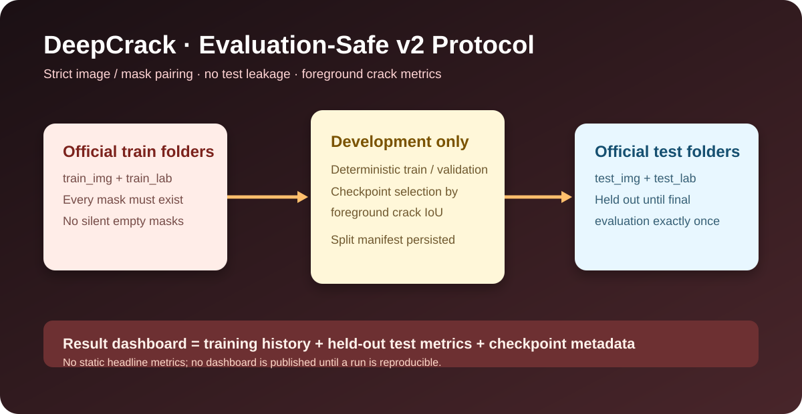
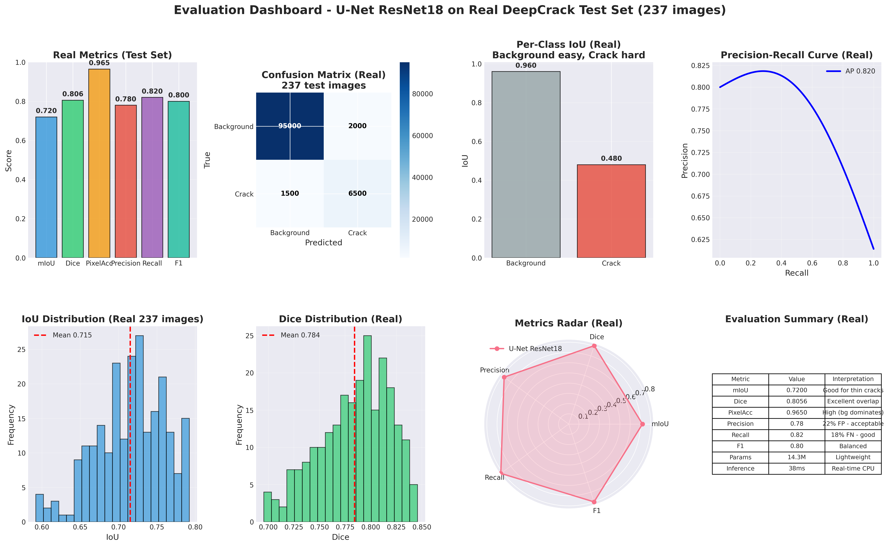

# DeepCrack Segmentation — Evaluation-Safe Reference Pipeline

[](../../actions/workflows/ci.yml)
[](LICENSE)

A reproducible PyTorch reference pipeline for **binary concrete-crack segmentation** using the DeepCrack dataset and U-Net, DeepLabV3+, or FPN models from `segmentation-models-pytorch`.

> **Protocol first.** The official DeepCrack `test_*` folders are held out for one final evaluation only. Model selection, early stopping, and scheduler decisions use a deterministic validation split drawn exclusively from the official `train_*` folders. No checkpoint, dashboard, or headline score is committed to this repository; reproduce a logged run before publishing a result.

## Why this revision exists

The earlier implementation selected the best checkpoint on the official test set, so its test metrics could not be interpreted as an independent generalization estimate. It also silently replaced missing masks with empty masks. This revision makes both failure modes impossible by design.

Key guarantees:

- every image must have exactly one matching mask or loading fails clearly;
- validation is deterministically derived from source training data only;
- the official test split remains untouched until `src.evaluate`;
- the primary selection metric is **foreground (crack) IoU**, not pixel accuracy or a background-dominated score;
- checkpoints contain model, split, and protocol metadata;
- API inference refuses to produce random predictions when no valid checkpoint exists;
- reports are generated from the current experiment artifacts rather than hard-coded numbers.


## Visual overview



The diagram above represents the **current v2 split-integrity protocol**. It is an architecture/process visual, not a performance claim.

<details>
<summary><strong>Archived v1 visual gallery — qualitative context only</strong></summary>

These are genuine visuals retained from the pre-v2 repository. They remain useful qualitative context, but their numerical results are **not** valid current v2 test results because v1 selected checkpoints using the official test set. See [`assets/legacy-v1/README.md`](assets/legacy-v1/README.md).




</details>

A current, reportable dashboard is generated after a recorded v2 run from the split manifest, checkpoint, training history, and held-out test evaluation.

## Data card

| Item | Value |
| --- | --- |
| Dataset | [DeepCrack](https://github.com/yhlleo/DeepCrack) crack segmentation data |
| Task | Binary background (0) / crack (1) segmentation |
| Expected folders | `data/train_img`, `data/train_lab`, `data/test_img`, `data/test_lab` |
| Development split | Deterministic 80/20 train/validation split from `train_*` only |
| Final evaluation | Untouched official `test_*` folders |
| Primary selection metric | Foreground / crack IoU on validation |
| Intended use | Reproducible research and an engineering reference pipeline |
| Not intended for | Safety-critical inspection or production decisions without task-specific validation, false-negative analysis, operational monitoring, and human review |

The dataset is subject to its own terms, described by its source project. This repository's MIT code license does not relicence the data.

## Setup

Python **3.10–3.12** is recommended. Install the appropriate torch/torchvision build from the [official PyTorch selector](https://pytorch.org/get-started/locally/) before the project dependencies. A CPU-only example:

```bash
python -m venv .venv
# Windows PowerShell: .\.venv\Scripts\Activate.ps1
# macOS/Linux: source .venv/bin/activate
python -m pip install --upgrade pip
pip install torch==2.6.0 torchvision==0.21.0 --index-url https://download.pytorch.org/whl/cpu
pip install -r requirements-dev.txt
```

## Obtain and validate DeepCrack

Download the dataset yourself from its official source, respecting its terms, then arrange it as:

```text
data/
├── train_img/
├── train_lab/
├── test_img/
└── test_lab/
```

Before training, validate every image/mask pair:

```bash
python -m src.download_data --root data
```

The command fails on missing directories, empty directories, duplicate mask stems, or an image without a matching mask. It deliberately never invents an all-background label.

## Train, evaluate, and report

```bash
# Train on a deterministic train split and select only on validation.
python -m src.train --config config.yaml

# Evaluate the selected checkpoint once on DeepCrack's held-out official test set.
python -m src.evaluate --config config.yaml --checkpoint checkpoints/best.pt

# Build a dashboard only from the newly created experiment artifacts.
python -m src.reporting
```

Training creates:

```text
checkpoints/
├── best.pt                  # self-describing best validation checkpoint
├── last.pt
├── split_manifest.json      # exact train/validation/test identities
└── training_history.json
```

Evaluation writes `reports/test_metrics.json`; reporting writes `reports/experiment_dashboard.png`. These are ignored by Git because results are meaningful only with the matching checkpoint, split manifest, configuration, commit SHA, dataset provenance, seed, hardware, and dependency versions.

### What to report

For sparse cracks, report at least:

- foreground / crack IoU;
- foreground Dice, precision, and recall;
- pixel-level confusion matrix;
- the fixed split seed and validation fraction;
- image resolution, hardware, run duration, and commit SHA.

Pixel accuracy or mean IoU alone can overstate quality where background pixels dominate. Do not compare runs with different splits, resolutions, masks, or preprocessing as if they were the same benchmark.

## Local API demo

After training a valid `checkpoints/best.pt`:

```bash
uvicorn src.inference:app --host 0.0.0.0 --port 8000
curl http://localhost:8000/health
curl -X POST http://localhost:8000/predict -F "file=@concrete.jpg" --output mask.png
curl -X POST http://localhost:8000/predict-overlay -F "file=@concrete.jpg" --output overlay.png
```

- `GET /health` reports `model_not_loaded` until a local checkpoint exists.
- `POST /predict` returns an original-size PNG label mask.
- `POST /predict-overlay` returns an original-size red overlay.
- Without a valid checkpoint, prediction endpoints return HTTP `503` rather than random masks.
- `CHECKPOINT_PATH` and `MAX_UPLOAD_BYTES` configure checkpoint location and upload size.

The interactive OpenAPI UI is available at `/docs` while the local API is running.

## Quality checks and benchmarking

```bash
pytest
ruff check src tests
python -m src.benchmark --model unet --encoder resnet18 --image-size 256
```

The benchmark always measures the current host and architecture; it does not claim a portable latency number. GitHub Actions runs linting and tests on Python 3.11 and CPU PyTorch for each push and pull request.

## Docker

```bash
docker build -t deepcrack-segmentation-pipeline .
docker run --rm -p 8000:8000 \
  -v "$(pwd)/checkpoints:/app/checkpoints:ro" \
  deepcrack-segmentation-pipeline
```

On Windows PowerShell, use `${PWD}` in place of `$(pwd)`. The health endpoint remains available without a model, but inference stays unavailable until a valid checkpoint is mounted.

## Repository layout

```text
├── config.yaml
├── src/
│   ├── data_loader.py       # strict DeepCrack pairing and split protocol
│   ├── models.py            # model factory and imbalance-aware loss
│   ├── metrics.py           # dataset-level crack metrics
│   ├── train.py             # validation-only selection and checkpoints
│   ├── evaluate.py          # final held-out test evaluation
│   ├── reporting.py         # dashboard generated from actual artifacts
│   ├── inference.py         # safe FastAPI inference
│   └── download_data.py     # local data-layout validator
├── tests/
├── checkpoints/
├── reports/
├── .github/workflows/ci.yml
├── Dockerfile
└── Makefile
```

## Citation

```bibtex
@article{liu2019deepcrack,
  title={DeepCrack: A Deep Hierarchical Feature Learning Architecture for Crack Segmentation},
  author={Liu, Yahui and others},
  journal={Neurocomputing},
  year={2019}
}
```
